# Explore Me

English | [日本語](#日本語)

**File Explorer, in two panes.** Explore Me is a tabbed, dual-pane file manager for Windows that looks and works like the Windows 11 File Explorer, so there is nothing new to learn. It adds what File Explorer does not have.

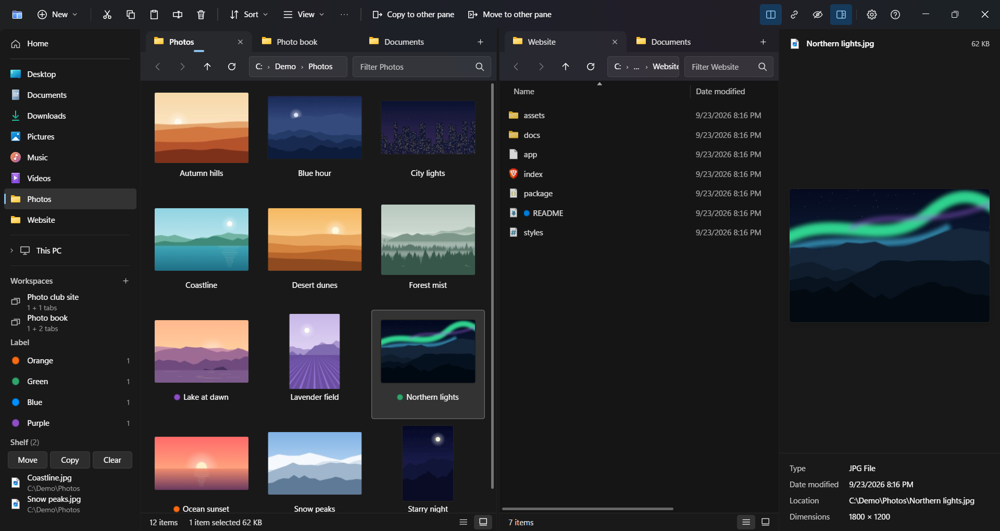

**[Download the latest version](../../releases/latest)** · free · Windows 11 (64-bit) · English and Japanese

- **Two panes, each with tabs.** Shift+F5 copies and Shift+F6 moves the selection to the other pane
- **Quick Look.** Space shows a large preview of photos (HEIC and camera RAW too), video, PDF and Office files, and the arrow keys go through the folder
- **Undo that brings files back.** An Undo button right after a delete, move or copy. A file replaced by a copy or move goes to the Recycle Bin (on local drives), so Undo restores it too

## Features

- The same keys and right-click menu as File Explorer (plus the full Windows menu under "Show more options")
- A command palette (Ctrl+K) that finds commands and folders by name
- A preview for many kinds of files: photos including HEIC and camera RAW (through the codecs in Windows), video and audio, PDF, Word / Excel / PowerPoint and OpenDocument files (without Office), EPUB, fonts, the contents of archives, who signed a program, and the details File Explorer shows (duration, camera, author…)
- Workspaces (save and reopen a whole set of tabs), color labels, and the Shelf (collect items with Ctrl+S, then move or copy them together)
- Disk usage, flat view, and search through subfolders (uses Everything or the Windows index when available)
- Filter with wildcards and conditions (`*.jpg`, `size:>10MB`, `date:today`) and group by date or date taken; the sort order and grouping are remembered for each folder
- Open zip, 7z, rar, tar.gz and other archives like folders (read-only) and copy items out of them; create zip files
- Free space is checked before copying, and on FAT32 drives files of 4 GB or more are left out with a note, instead of failing at the end
- English / Japanese, light / dark

## Is it safe?

- **Nothing about you or your files is sent.** The only network access is the update check to GitHub, and you can turn it off (Settings → About)
- **It does not change how Windows opens folders** unless you turn on "Open folders with Explore Me" or "Open Explore Me with Win+E" in Settings. Turning them off, or uninstalling, puts back what was there before
- **Deleted items go to the Recycle Bin** (on drives that have one). Only Shift+Delete deletes them for good, and it always asks first
- **The installer is not code-signed**, so Windows may warn you the first time you run it. Each release lists the installer's SHA-256 (see [Download](#download))

## Screenshots

**Two panes**: select items and press Shift+F5 to copy them to the other pane.

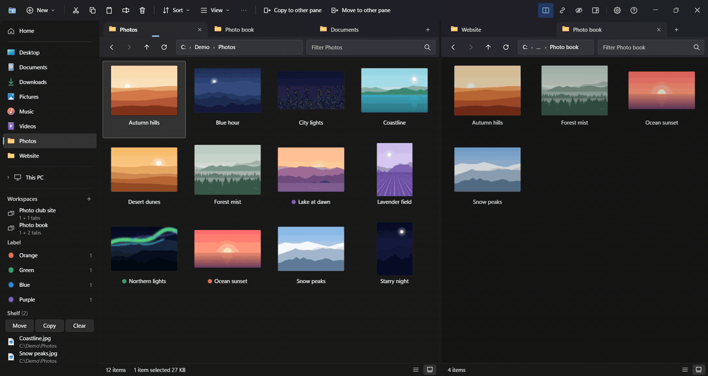

**Quick Look**: press Space for a large preview, then the arrow keys to go through the folder.

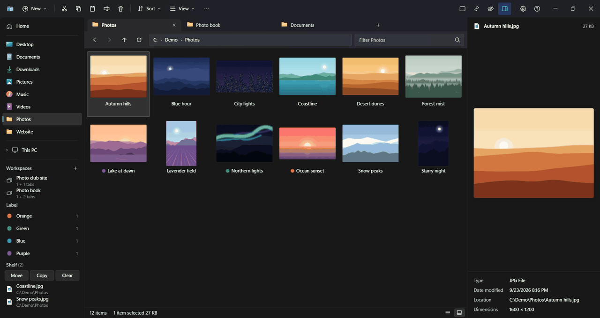

**Undo, even for a replaced file**: when a file with the same name is already there, it shows which one is newer. Overwrite it, and Undo brings the old one back from the Recycle Bin.

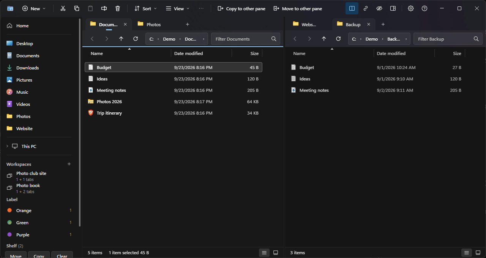

**Archives open like folders**: open a zip, then copy what is inside to the other pane with Shift+F5.

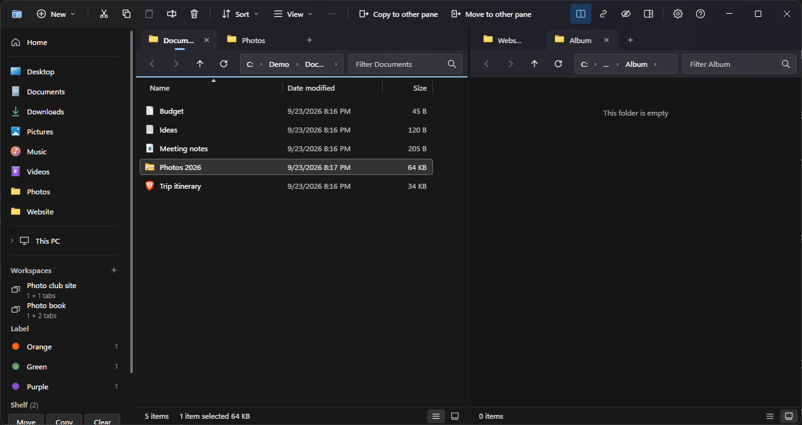

**One pane or two**: switch from the command palette (Ctrl+K) or with Ctrl+Shift+D. Alt+P shows or hides the preview.

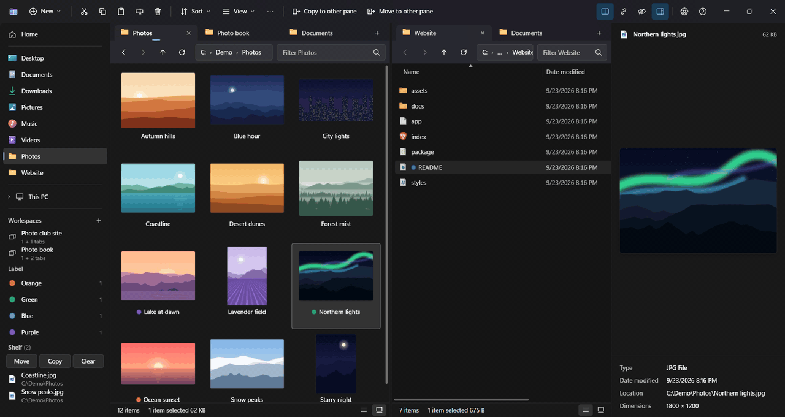

**Light theme**, with a Markdown file in the preview:

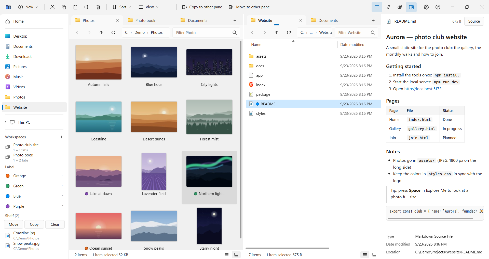

## Usage

It works like File Explorer. Press **F1** in the app for every shortcut, and **Ctrl+,** (or the gear at the top right) for Settings.

### The window

- Navigation on the left: Home, pinned folders, This PC (drives), Workspaces, the Shelf
- On the right: two panes, each with its own tabs; the one you last clicked is the one you work in (Ctrl+Shift+D switches to a single pane)
- The app opens on Home (frequent places, drives and recent items)
- The language follows Windows (English or Japanese); change it in Settings → General → Language

### Common shortcuts

| Action | Keys |
| --- | --- |
| Back / up one folder | Backspace / Alt+↑ |
| Type in the address bar | Ctrl+L (Alt+D, F4) |
| Filter this folder / search subfolders too | Ctrl+E / Ctrl+Shift+F |
| New tab / close tab | Ctrl+T / Ctrl+W |
| Single pane / two panes | Ctrl+Shift+D |
| Copy / move to the other pane | Shift+F5 / Shift+F6 |
| Large preview (Quick Look) | Space |
| Command palette (find commands and folders by name) | Ctrl+K |
| Put on the Shelf (move or copy them together later) | Ctrl+S |
| Undo / redo (also a delete to the Recycle Bin) | Ctrl+Z / Ctrl+Y |
| Large icons / medium icons / list / details | Ctrl+Shift+2 / 3 / 5 / 6 |
| Show hidden files | Ctrl+H |

- Right-click opens a Windows 11 style menu. For the full Windows menu (including items added by 7-Zip and other apps), Shift+right-click or choose "Show more options"
- Double-click an archive (zip, 7z, rar, tar.gz and more) to look inside it like a folder; copy items out with Ctrl+C or Shift+F5. "Extract here" in its right-click menu extracts all of it
- In the filter box (Ctrl+E), `*.jpg`, `ext:png`, `kind:picture`, `size:>10MB` and `date:today` narrow the list; separate several with spaces
- Drag a tab to reorder it or to move it to the other pane. When the tabs do not fit, use the ◀ ▶ buttons or the list of every tab (▾)
- Turn on "Open folders with Explore Me" in Settings to open folders from the desktop and other apps in Explore Me as well, and "Open Explore Me with Win+E" for Win+E (it takes effect once you sign in again)

## Download

Download `ExploreMe-Setup-<version>.exe` from [Releases](../../releases/latest) and run it.

### System requirements

| | |
| --- | --- |
| OS | Windows 11 (64-bit, x64) |
| Windows 10 | Not tested (it is expected to work, but has not been checked) |
| 32-bit Windows (x86) | Not supported |
| Windows on ARM (ARM64) | Not tested (Windows 11 on ARM runs x64 apps through emulation, so it is expected to work) |
| Installation | Per user (no administrator rights needed); you can choose the folder |

### If Windows shows "Windows protected your PC"

The installer is not code-signed, so Windows SmartScreen may show this screen the first time you run it.
Choose **More info → Run anyway**.

To make sure the file is the genuine one, compare its SHA-256 with the value on the release page. In PowerShell:

```powershell
Get-FileHash .\ExploreMe-Setup-0.5.1.exe -Algorithm SHA256
```

VirusTotal: the v0.5.0 installer, [0 / 68 detections](https://www.virustotal.com/gui/file/f557a98aca8ffaeaace8806317d2736561f848a80fcd19062874a7f6544774b1) (scanned on 2026-09-26).

## Updates

The app checks for a new version when it starts, downloads it in the background and installs it when you quit (turn this off in Settings → About).
The update check (GitHub) is the only network access. No usage data is sent.

## Privacy

- Your files are handled on your PC only; nothing about them is sent anywhere
- The update check is a request to GitHub, which may record your IP address under GitHub's own privacy statement
- Feedback is sent from your own mail app. The author uses your email address and message only to reply and to improve the app, keeps them only as long as needed, and does not share them except as required by law. To ask about, correct or delete them, write to the feedback address shown in the app

## Uninstall

Uninstall Explore Me from Windows Settings → Apps → Installed apps.
If "Open folders with Explore Me" or "Open Explore Me with Win+E" was on, File Explorer takes them back (Win+E once you sign in again).

## License

Free for personal and business use. Redistribution and modification are not permitted. See [LICENSE](LICENSE).
Bundled third-party software (Electron, 7-Zip and others) is covered by its own licenses (`THIRD_PARTY_NOTICES.txt` in the installation folder). The source code of the bundled 7-Zip (GNU LGPL) is attached to each release.

## Copyright

Copyright (c) 2026 ternando0831-lang

Windows and Visual Studio Code are trademarks of the Microsoft group of companies. Other product names are trademarks of their respective owners.

## Feedback

Ask questions, share ideas or report bugs in [Discussions](../../discussions). You can also send them privately by email from Settings → Feedback in the app.

## Known limitations

- 7z, rar and the like can be extracted, not created (only zip can be created). Password-protected archives cannot be extracted
- An archive opened as a folder is read-only, and its items cannot be dragged out (use Copy or Copy to other side). Archives of more than 200,000 items are not opened as folders
- Old Japanese archives (lzh, tar and others with Shift_JIS names) may not extract with the right file names
- The preview of Office, OpenDocument and EPUB files shows their text and tables, not their layout. Pictures such as HEIC or RAW show only when Windows has the codec for them (Microsoft Store extensions); video and audio formats the app cannot play (avi, wmv, wma…) show Windows' thumbnail and details instead

---

# 日本語

**いつものエクスプローラーのまま、2 画面に。** Windows 11 のエクスプローラーと同じ見た目・操作で使える、タブと 2 画面のファイラーです。覚え直すことはありません。そのうえで、エクスプローラーにないものを足しています。

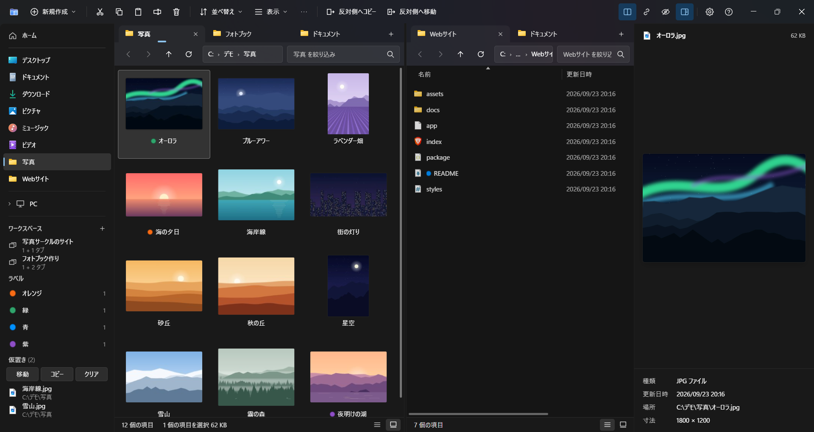

**[最新版をダウンロード](../../releases/latest)**（無料・Windows 11 の 64 ビット版・日本語と英語）

- **2 画面とタブ**: 選んだものを Shift+F5 で反対側へコピー、Shift+F6 で移動
- **クイックルック**: Space で大きくプレビュー。HEIC やカメラの RAW の写真、動画、PDF、Office のファイルも。矢印キーでフォルダーの中を次々に見られます
- **置き換えたファイルも元に戻せる**: 削除・移動・コピーの直後に「元に戻す」ボタン。コピーや移動で置き換えたファイルはごみ箱に入るので（PC の内蔵ドライブ）、元に戻すで戻ります

## 機能

- エクスプローラーと同じキー操作・右クリックメニュー（「その他のオプションを確認」で Windows 本来のメニューも）
- コマンドパレット（Ctrl+K）で、操作やフォルダーを名前で探せます
- いろいろなファイルのプレビュー: HEIC やカメラの RAW を含む写真（Windows のコーデックを使用）、動画・音声、PDF、Word・Excel・PowerPoint と OpenDocument のファイル（Office が無くても）、EPUB、フォント、書庫の中身、プログラムの署名元、エクスプローラーの詳細と同じ情報（長さ・カメラ・作成者など）
- ワークスペース（開いているタブ一式を保存して呼び出す）、カラーラベル、仮置き（Ctrl+S で集めてまとめて移動）
- 容量の内訳、フラット表示、サブフォルダーの検索（Everything・Windows のインデックスがあれば使う）
- 絞り込みにワイルドカードと条件（`*.jpg`・`サイズ:>10MB`・`日付:今日`）、日付や撮影日時でのグループ表示。並べ替えとグループはフォルダーごとに覚えます
- zip・7z・rar・tar.gz などの書庫をフォルダーのように開いて（読み取り専用）中の項目を取り出せます。zip の作成も
- コピーの前に行き先の空き容量を確認。FAT32 のドライブには 4 GB 以上のファイルを置けないので、最後に失敗する代わりに、その旨を添えて外します
- 日本語 / 英語、ライト / ダーク

## 安全ですか？

- **あなたやファイルについての情報は送りません。** ネットにつなぐのは GitHub への更新確認だけで、オフにもできます（設定 → バージョン情報）
- **Windows がフォルダーを開く方法は変えません。** 変わるのは、設定で「フォルダーを Explore Me で開く」「Win+E で Explore Me を開く」をオンにしたときだけです。オフにするかアンインストールすると元に戻ります
- **削除したものはごみ箱に入ります**（ごみ箱のあるドライブ）。完全に削除するのは Shift+Delete のときだけで、必ず確認します
- **インストーラーはコード署名をしていません。** 初めて実行するときに Windows の警告が出ることがあります。各リリースにインストーラーの SHA-256 を載せています（[ダウンロード](#ダウンロード)）

## スクリーンショット

**2 画面**: 選んで Shift+F5 を押すと、反対側のペインへコピーします。

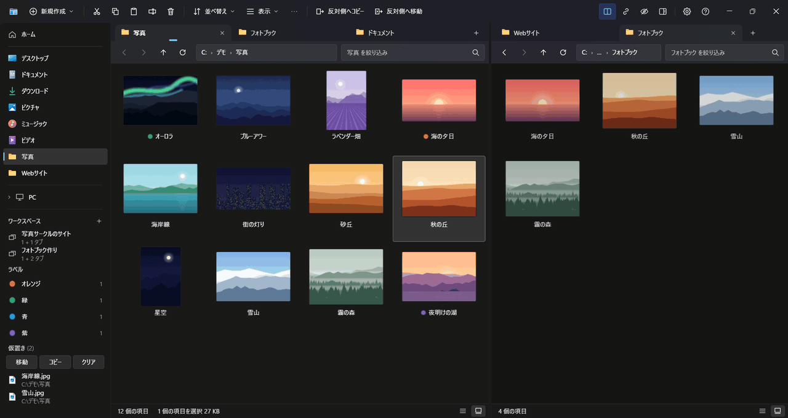

**クイックルック**: Space で大きく表示し、矢印キーでフォルダーの中を順に見られます。

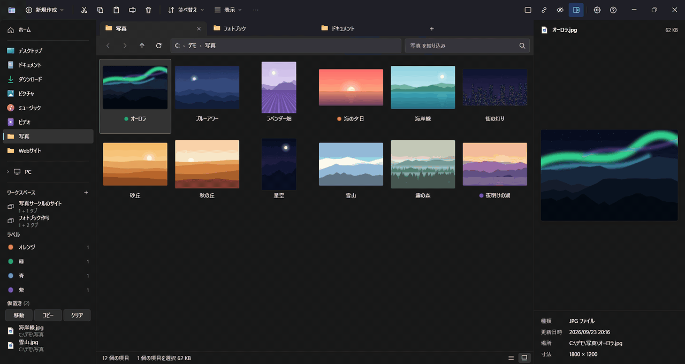

**置き換えたファイルも元に戻せる**: 同じ名前のファイルがあると、どちらが新しいかを並べて見せます。上書きしても、元に戻すで古いファイルがごみ箱から戻ります。

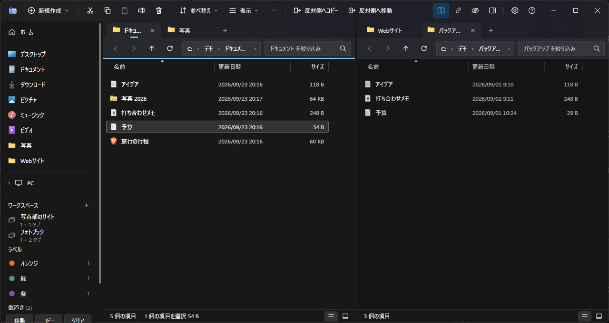

**書庫をフォルダーのように開く**: zip を開いて、中のファイルを Shift+F5 で反対側へ取り出します。

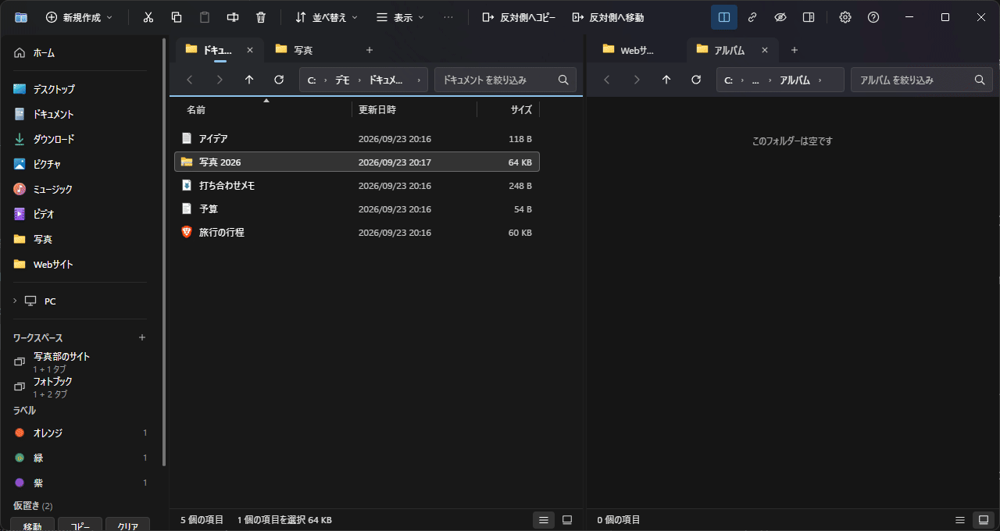

**1 画面と 2 画面**: コマンドパレット（Ctrl+K）か Ctrl+Shift+D で切り替えます。Alt+P でプレビューの表示・非表示。

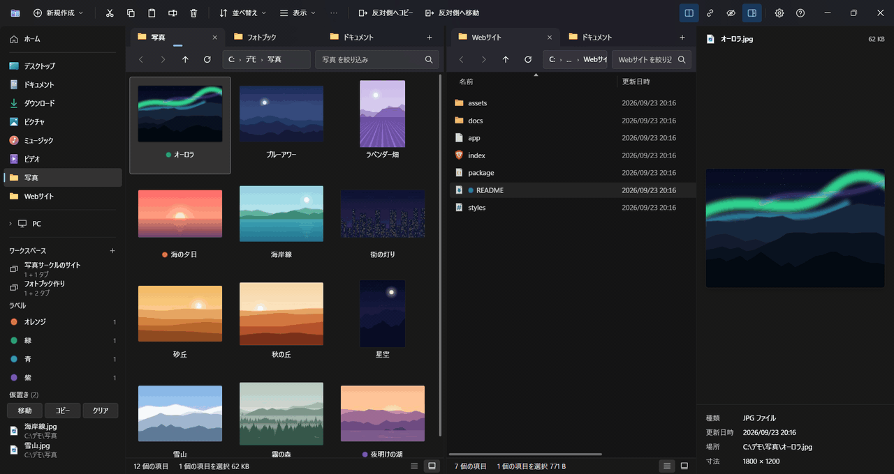

**ライトテーマ**（プレビューに Markdown を表示）:

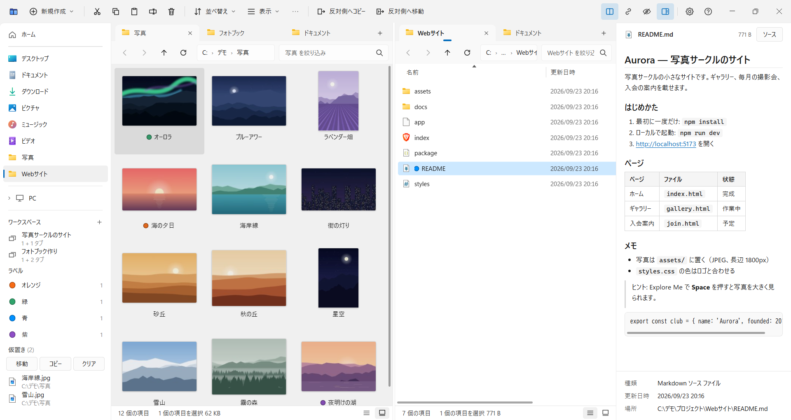

## 使い方

エクスプローラーと同じように使えます。操作の一覧はアプリの中で **F1**、設定は **Ctrl+,**（または右上の歯車）です。

### 画面

- 左のナビゲーション: ホーム・ピン留めしたフォルダー・PC（ドライブ）・ワークスペース・仮置き
- 右側: 左右 2 つのペイン。それぞれにタブがあり、クリックした側が操作の対象になります（Ctrl+Shift+D で 1 画面にも）
- 起動するとホーム（よく使う場所・ドライブ・最近使った項目）が開きます
- 表示言語は Windows に合わせます（日本語か英語）。設定 → 全般 → 言語 で変えられます

### よく使う操作

| 操作 | キー |
| --- | --- |
| 戻る / 上のフォルダーへ | Backspace / Alt+↑ |
| アドレスバーに入力 | Ctrl+L（Alt+D・F4） |
| このフォルダーを絞り込み / サブフォルダーも検索 | Ctrl+E / Ctrl+Shift+F |
| 新しいタブ / タブを閉じる | Ctrl+T / Ctrl+W |
| 1 画面 / 2 画面の切り替え | Ctrl+Shift+D |
| 反対側のペインへコピー / 移動 | Shift+F5 / Shift+F6 |
| 大きなプレビュー（クイックルック） | Space |
| コマンドパレット（操作やフォルダーを名前で探す） | Ctrl+K |
| 仮置きに入れる（あとでまとめて移動・コピー） | Ctrl+S |
| 元に戻す / やり直す（ごみ箱への削除も戻せます） | Ctrl+Z / Ctrl+Y |
| 表示の切り替え（大アイコン / 中アイコン / 一覧 / 詳細） | Ctrl+Shift+2 / 3 / 5 / 6 |
| 隠しファイルの表示 | Ctrl+H |

- 右クリックは Windows 11 風のメニューです。7-Zip などが加えた項目も含む Windows 本来のメニューは、Shift+右クリックか「その他のオプションを確認」から
- 書庫（zip・7z・rar・tar.gz など）はダブルクリックでフォルダーのように中を見られます。中の項目は Ctrl+C や Shift+F5 で取り出せます。右クリックの「ここに展開」で全部を展開できます
- 絞り込み欄（Ctrl+E）では `*.jpg`・`拡張子:png`・`種類:画像`・`サイズ:>10MB`・`日付:今日` で絞れます。空白で区切って組み合わせられます
- タブはドラッグで並べ替え・反対側のペインへ移動できます。入りきらないときは ◀ ▶ かすべてのタブの一覧（▾）から
- 「フォルダーを Explore Me で開く」を設定でオンにすると、デスクトップやほかのアプリから開いたフォルダーも Explore Me で開きます。「Win+E で Explore Me を開く」をオンにすると Win+E でも（サインインし直すと反映されます）

## ダウンロード

[Releases](../../releases/latest) から `ExploreMe-Setup-<版>.exe` をダウンロードして実行します。

### 動作環境

| 項目 | 内容 |
| --- | --- |
| OS | Windows 11（64 ビット、x64） |
| Windows 10 | 未確認（動く見込みはありますが、確認していません） |
| 32 ビット版 Windows（x86） | 対応していません |
| ARM 版 Windows（ARM64） | 未確認（ARM 版 Windows 11 は x64 のアプリをエミュレーションで動かすため、動く見込みはあります） |
| インストール | ユーザーごと（管理者権限は不要）。インストール先は選べます |

### 「Windows によって PC が保護されました」と出たら

このアプリはコード署名をしていないため、初めて実行するときに Windows の SmartScreen がこの画面を出すことがあります。
**「詳細情報」→「実行」** で進めてください。

心配な場合は、ダウンロードしたファイルが本物か確かめられます。各リリースのページに SHA-256 の値を載せています。PowerShell で次を実行し、同じ値か比べてください。

```powershell
Get-FileHash .\ExploreMe-Setup-0.5.1.exe -Algorithm SHA256
```

VirusTotal での検査結果（v0.5.0 のインストーラー）: [検出 0 / 68](https://www.virustotal.com/gui/file/f557a98aca8ffaeaace8806317d2736561f848a80fcd19062874a7f6544774b1)（2026-09-26 に検査）。

## 更新

起動したときに新しい版を確認し、裏でダウンロードして、アプリを終了したときに更新します（設定 → バージョン情報で切り替えられます）。
通信するのは、この更新の確認（GitHub）だけです。使い方などの情報は送りません。

## 個人情報

- ファイルはすべて PC の中だけで扱い、外部には何も送りません
- 更新の確認は GitHub への通信で、GitHub は自社のプライバシー方針に従って IP アドレスを記録することがあります
- フィードバックは利用者自身のメールアプリから送られます。受け取ったメールアドレスと内容は、返信とアプリの改善のためだけに使い、必要な期間だけ保管し、法令に基づく場合を除いて第三者に提供しません。開示・訂正・削除のご依頼は、アプリに表示しているフィードバックの宛先へ

## アンインストール

Windows の「設定 → アプリ → インストールされているアプリ」から Explore Me をアンインストールします。
「フォルダーを Explore Me で開く」「Win+E で Explore Me を開く」をオンにしていた場合も、元のエクスプローラーに戻ります（Win+E はサインインし直すと反映されます）。

## ライセンス

無料で使えます（個人・法人とも）。再配布・改変はできません。詳しくは [LICENSE](LICENSE) を見てください。
同梱しているソフトウェア（Electron、7-Zip など）はそれぞれのライセンスに従います（インストール先の `THIRD_PARTY_NOTICES.txt`）。同梱の 7-Zip（GNU LGPL）のソースコードは、各リリースに添付しています。

## 著作権

Copyright (c) 2026 ternando0831-lang

Windows・Visual Studio Code は Microsoft グループの商標です。その他の製品名は、それぞれの権利者の商標です。

## フィードバック

質問・要望・不具合の報告は [Discussions](../../discussions) へどうぞ。アプリの「設定 → フィードバック」から、メールで非公開に送ることもできます。

## 既知の制限

- 7z・rar などは展開だけです（作成は zip のみ）。パスワード付きの書庫は展開できません
- フォルダーのように開いた書庫の中は読み取り専用で、項目をドラッグして外へ出すことはできません（コピーか「反対側へコピー」で取り出します）。項目が 20 万を超える書庫はフォルダーとしては開きません
- 古い日本語の書庫（Shift_JIS の名前の lzh・tar など）は、名前が正しく展開されないことがあります
- Office・OpenDocument・EPUB のプレビューは文字と表だけで、レイアウトは再現しません。HEIC や RAW などの写真は、Windows にそのコーデック（Microsoft Store の拡張機能）があるときだけ表示できます。アプリで再生できない動画・音声（avi・wmv・wma など）は、代わりに Windows のサムネイルと詳細を表示します
